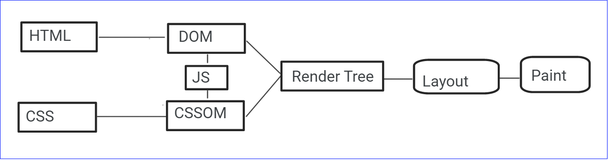

# How browser renders the html?

Once the browser gets the html pages :

    # 1. Parser parses the html, generate tokens, create nodes and generates the DOM

    # 2. Parses the CSS to create CSSOM

    # 3. Browser execute the Javascript and recreate the DOM & CSSOM if needed.

    # 4. Create the Render Tree combining DOM & CSSOM.

    # 5. Prepares layout, places elements in the layout and create bitmaps to display in the screen.

References :

https://www.youtube.com/watch?v=SmE4OwHztCc

https://www.youtube.com/watch?v=PkOBnYxqj3k
